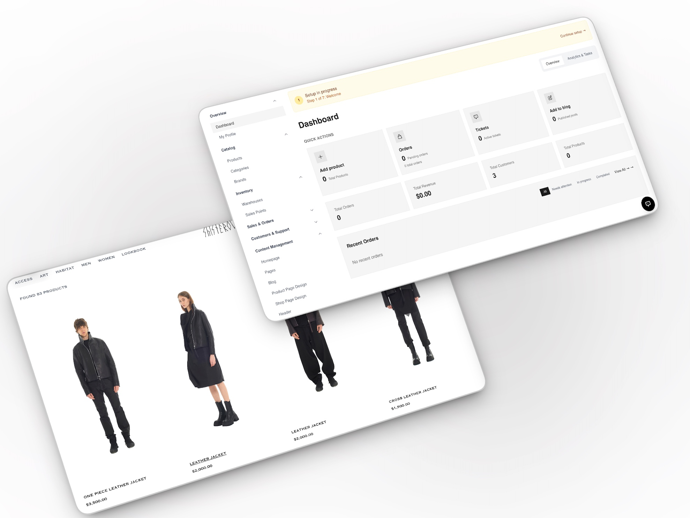

# SIB-CMS



Полнофункциональный e-commerce проект для магазина: витрина на `SvelteKit`, backend API на `Express + TypeScript`, `PostgreSQL` через `Prisma`, хранение файлов в `S3`/`MinIO`, отдельный RAG-контур для `GPT Assistant`.

## Что внутри

- `frontend/` — клиентская часть и admin UI на `SvelteKit`
- `backend/` — API, бизнес-логика, Prisma, сиды, служебные скрипты
- `docker-compose.dev.yml` — локальный dev-стек с `PostgreSQL`, `pgvector` и `MinIO`
- `docker-compose.yml` — production/self-hosted compose
- `Makefile` — команды для запуска, обновления, миграций, логов и бэкапов

## Стек

- Frontend: `SvelteKit`, `Svelte 5`, `Vite`, `Tailwind CSS`
- Backend: `Node.js`, `Express`, `TypeScript`, `Prisma`
- Database: `PostgreSQL`
- Files: `MinIO` или совместимое `S3`
- AI/RAG: `OpenAI SDK`, отдельная `PostgreSQL + pgvector` база для RAG
- Infra: `Docker Compose`, `Makefile`

## Как управлять проектом

Ниже удобная карта управления проектом по разделам. Если нужно быстро понять, куда идти с конкретной задачей, можно ориентироваться так:

- Запуск и остановка проекта: `docker-compose.dev.yml`, `docker-compose.yml`, `Makefile`
- Настройка окружения: `.env.dev`, `.env.dev.example`, `.env.docker.example`, `frontend/.env.example`
- Frontend и витрина: `frontend/`
- Backend и API: `backend/src/`
- База данных и миграции: `backend/prisma/`, `backend/prisma-rag/`
- Админка и контент: `frontend/src/routes/(admin)/admin/`
- GPT Assistant и RAG: `backend/src/services/gpt-*`, `backend/src/services/rag.service.ts`
- Бэкапы и восстановление: `backend/src/scripts/backup-*.ts`, `backend/src/scripts/restore-*.ts`
- Production и деплой: `docker-compose.yml`, `.env.docker.example`, `scripts/check-prod-env.sh`

Практически это выглядит так:

- Нужно запустить проект локально: смотри раздел `Быстрый старт`
- Нужно поменять переменные окружения: смотри раздел `Переменные окружения`
- Нужно применить миграции или пересоздать базу: смотри раздел `Работа с базой данных`
- Нужно включить или проверить RAG: смотри раздел `RAG / GPT Assistant`
- Нужно обновить прод или self-hosted инстанс: смотри раздел `Production / self-hosted`
- Нужно снять бэкап или восстановить данные: смотри раздел `Бэкапы и восстановление`

## Админка и управление по фичам

Основная административная зона находится в `frontend/src/routes/(admin)/admin/`. Через неё можно управлять магазином по функциональным разделам.

### Каталог

- `Products` — создавать и редактировать товары, управлять карточками, медиа, ценами и статусами
- `Categories` — настраивать категории каталога
- `Brands` — управлять брендами
- `Lookbook` — вести lookbook и связанные материалы
- `Pages` — создавать и редактировать контентные страницы

### Витрина и контент

- `Homepage` — управлять секциями главной страницы
- `Header` — настраивать шапку сайта и навигацию
- `Footer` — настраивать подвал сайта
- `Shop Page Design` — менять оформление страницы каталога
- `Product Page Design` — менять оформление страницы товара
- `Blog` — управлять статьями и контентом блога

### Продажи и заказы

- `Orders` — просматривать и сопровождать заказы
- `Returns` — обрабатывать возвраты
- `Payment Requests` — работать с запросами на оплату
- `Payment Gateways` — настраивать доступные платёжные шлюзы
- `Promo` — создавать и администрировать промокоды и акции
- `Marketing` — управлять маркетинговыми сценариями и промо-активностями

### Клиенты и коммуникации

- `Customers` — просматривать клиентскую базу
- `Tickets` — вести обращения и поддержку
- `Partners` — управлять партнёрской программой
- `Profile` — редактировать профиль администратора

### Логистика и операционка

- `Warehouses` — управлять складами
- `Sales Points` — управлять точками продаж
- `Countries` — настраивать страны
- `Languages` — управлять языками интерфейса и локализацией
- `Currency Rates` — обновлять и контролировать валютные курсы
- `Delivery Tracking` — настраивать и проверять отслеживание доставки

### Финансы и отчётность

- `Accounting` — работать с бухгалтерскими сущностями и финансовыми данными
- `Reports` — смотреть отчёты по работе магазина
- `Dashboard` — видеть сводную информацию по проекту
- `Backups` — запускать и контролировать резервное копирование

### Система и доступы

- `Settings` — общие системные настройки проекта
- `Settings -> Admins` — управлять администраторами
- `Settings -> Activity Logs` — смотреть журнал действий
- `Settings -> API Keys` — управлять API-ключами
- `Settings -> License` — управлять лицензией
- `Onboarding` — проходить и повторно использовать стартовую настройку проекта

### GPT Assistant

- `Settings -> GPT Assistant` — включать и настраивать AI-функции
- `Settings -> GPT Assistant -> Prompts` — редактировать системные prompt-настройки
- `Settings -> GPT Assistant -> Analytics` — смотреть аналитику использования
- `Settings -> GPT Assistant -> Logs` — смотреть логи и диагностику
- `Settings -> GPT Assistant -> Test` — проверять поведение ассистента в тестовом режиме

Если нужно быстро найти, где управляется конкретная фича:

- товары, категории, бренды, lookbook: разделы каталога
- главная страница, header, footer, блог, дизайн страниц: разделы витрины и контента
- заказы, возвраты, промо, платежи: разделы продаж
- пользователи, тикеты, партнёры: разделы клиентов и коммуникаций
- языки, страны, валюты, склады, точки продаж: операционные разделы
- API keys, админы, логи: системные настройки

## Быстрый старт

### Вариант 1. Полностью локально через Docker

Рекомендуемый сценарий для первого запуска.

```bash
cp .env.dev.example .env.dev
docker compose --env-file .env.dev -f docker-compose.dev.yml up --build
```

После старта будут доступны:

- сайт: `http://localhost:8080`
- API: `http://localhost:3001`
- healthcheck: `http://localhost:3001/health`
- PostgreSQL: `localhost:15432`
- RAG PostgreSQL: `localhost:15433`
- MinIO API: `http://localhost:19000`
- MinIO Console: `http://localhost:19001`

Остановить стек:

```bash
docker compose --env-file .env.dev -f docker-compose.dev.yml down
```

С очисткой volumes:

```bash
docker compose --env-file .env.dev -f docker-compose.dev.yml down -v
```

### Вариант 2. Backend в Docker, frontend локально

Удобно для активной работы над UI.

1. Поднять backend-инфраструктуру:

```bash
./scripts/dev-start.sh
```

2. Проверить `frontend/.env`:

```env
VITE_API_PROXY_TARGET=3001
```

3. Запустить frontend:

```bash
cd frontend
npm install
npm run dev
```

По умолчанию фронтенд откроется на `http://localhost:5173`.

## Требования

- `Docker` и `Docker Compose`
- `Node.js 20+` и `npm` для локальной разработки без полного Docker-цикла
- `Make` для команд управления

## Переменные окружения

Основные шаблоны уже в репозитории:

- `.env.dev` — локальная рабочая копия для `docker-compose.dev.yml` (создаётся из `.env.dev.example`)
- `.env.dev.example` — шаблон для локальной разработки в Docker
- `.env.docker.example` — шаблон для self-hosted / production compose
- `frontend/.env.example` — локальный dev proxy фронтенда

Ключевые переменные:

- `DATABASE_URL` — основная база приложения
- `RAG_DATABASE_URL` и `RAG_DATABASE_DIRECT_URL` — отдельная база для RAG
- `FRONTEND_BASE_URL` — публичный URL фронтенда
- `CORS_ORIGIN` — разрешённые origin фронтенда
- `PUBLIC_SITE_URL` — канонический URL сайта
- `MINIO_*` — доступ к S3/MinIO
- `JWT_SECRET`, `JWT_REFRESH_SECRET`, `ENCRYPTION_KEY` — обязательны для production

## Основные команды

### Docker / сервисы

```bash
make docker-up
make docker-down
make docker-logs
make docker-build
make docker-dev
make status
make health
```

### Production / self-hosted

```bash
cp .env.docker.example .env
make prod-check
make prod-deploy
```

Важно: в production база данных не поднимается этим `docker-compose.yml`.

Текущий production compose запускает только:

- `frontend`
- `backend`

`PostgreSQL` для production нужно поднимать отдельно:

- как managed database у провайдера
- как отдельный сервер / отдельный контейнерный сервис
- как отдельный кластер вне этого application stack

Backend получает доступ к production-базе только через переменную окружения `DATABASE_URL`.

То есть production-схема такая:

```text
User -> Frontend -> Backend -> External PostgreSQL
                         -> External S3 / Object Storage
```

Что это значит на практике:

- не нужно ожидать, что `make prod-deploy` сам создаст production PostgreSQL
- перед деплоем база уже должна существовать и принимать подключения
- строка подключения к базе должна быть явно передана через `.env`
- аналогично `S3`/`MinIO` параметры тоже пробрасываются через `.env`

Минимально для production нужно задать:

```env
DATABASE_URL=postgresql://USER:PASSWORD@DB_HOST:5432/DB_NAME?schema=public
FRONTEND_BASE_URL=https://your-domain.com
CORS_ORIGIN=https://your-domain.com
PUBLIC_SITE_URL=https://your-domain.com

JWT_SECRET=replace-with-real-secret
JWT_REFRESH_SECRET=replace-with-real-secret
ENCRYPTION_KEY=replace-with-real-secret

MINIO_ENDPOINT=s3-provider-host
MINIO_PORT=443
MINIO_USE_SSL=true
MINIO_ACCESS_KEY=your-access-key
MINIO_SECRET_KEY=your-secret-key
MINIO_BUCKET_NAME=your-bucket
MINIO_PRIVATE_BUCKET_NAME=your-private-bucket
MINIO_PUBLIC_URL=https://files.your-domain.com
```

Порядок деплоя в production:

1. Поднять отдельную `PostgreSQL` базу.
2. Создать отдельную production-базу и пользователя приложения.
3. Подготовить `S3`/object storage с двумя bucket'ами: public для витринных медиа и private для документов, proof-of-payment и будущих внутренних/RAG файлов.
4. Заполнить `.env` на сервере или в панели деплоя.
5. Проверить env через `make prod-check`.
6. Запустить приложение через `make prod-deploy`.

Что делает `prod-deploy` после этого:

- проверяет `.env`
- запускает `npm audit`, линтеры и type-check
- собирает Docker-образы
- поднимает сервисы через `docker-compose.yml`

Backend при старте сам:

- ждёт доступность базы
- применяет `Prisma`-миграции
- запускает сервер

Если `DATABASE_URL` неверный или внешняя база недоступна, backend не поднимется.

Для этого проекта production `docker-compose.yml` следует воспринимать как compose для приложения, а не как compose для всей инфраструктуры.

## Работа с базой данных

Через `make`:

```bash
make db-migrate
make db-setup
make db-seed
make db-studio
make db-shell
```

Через backend npm scripts:

```bash
cd backend
npm run prisma:migrate
npm run prisma:migrate:deploy
npm run db:seed
npm run prisma:generate
```

## RAG / GPT Assistant

В проекте есть отдельный RAG-контур:

- основная `DATABASE_URL` не должна использоваться для RAG
- для RAG предусмотрена отдельная `PostgreSQL` база
- локально она поднимается вместе с `docker-compose.dev.yml`

Полезные команды:

```bash
cd backend
npm run prisma:generate:rag
npm run prisma:deploy:rag
```

Для базовой проверки можно смотреть:

- `GET /health`
- `GET /api/gpt-assistant/admin/health`

## Бэкапы и восстановление

Доступны готовые backend-скрипты:

```bash
cd backend
npm run backup:db
npm run restore:db
npm run list:backups
npm run backup:s3
npm run restore:s3
```

Для Docker-сценария:

```bash
make backup-migrate
```

## Структура проекта

```text
.
├── backend/
├── frontend/
├── docs/
├── scripts/
├── docker-compose.yml
├── docker-compose.dev.yml
└── Makefile
```

## Проверка после запуска

Минимальный smoke check:

1. Открыть `http://localhost:8080`
2. Проверить `http://localhost:3001/health`
3. Проверить, что `GET /api` отвечает `API v1`
4. Войти в admin-панель учёткой из env

## Лицензия

Проект распространяется под лицензией из файла [LICENSE](LICENSE).
